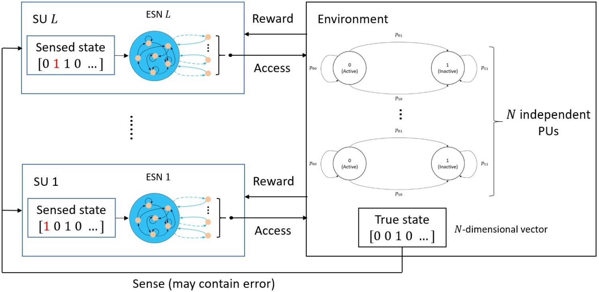

# Distributive Dynamic Spectrum Access Through Deep Reinforcement Learning: A Reservoir Computing-Based Approach (IoT-J-2019)

[Hao-Hsuan Chang](https://haohsuan2918.github.io/), 
Hao Song, 
[Yang Yi](https://www.yangyi.ece.vt.edu/index.html), 
Jianzhong (Charlie) Zhang,
and [Lingjia Liu](https://computing.ece.vt.edu/~lingjialiu/doku.php)

IEEE Internet of Things Journal, Vol. 6, No. 2, pp. 1938-1948, April 2019.

### Introduction
A combination of reservoir computing (RC) and deep Q-network (DQN) is utilized to design spectrum access strategies for secondary users (SUs) in dynamic spectrum access (DSA) networks.

### Citation

If you find the code and datasets useful in your research, please cite:

    @article{Chang2019DSA,
    author={Chang, Hao-Hsuan and Song, Hao and Yi, Yang and Zhang, Jianzhong and He, Haibo and Liu, Lingjia},
    journal= {IEEE Internet of Things Journal},
    title={Distributive Dynamic Spectrum Access Through Deep Reinforcement Learning: A Reservoir Computing-Based Approach},
    year={2019},
    volume={6},
    number={2},
    pages={1938--1948},
    month={April}}
 
### Training code
    >> main.py

### Plot results
    >> plot_figure.py
